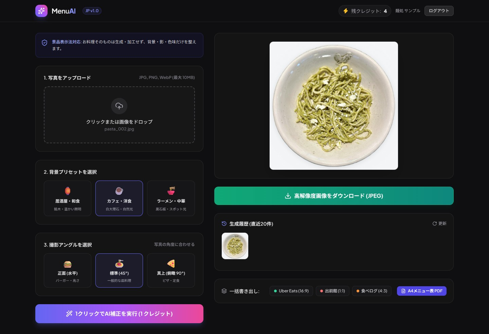
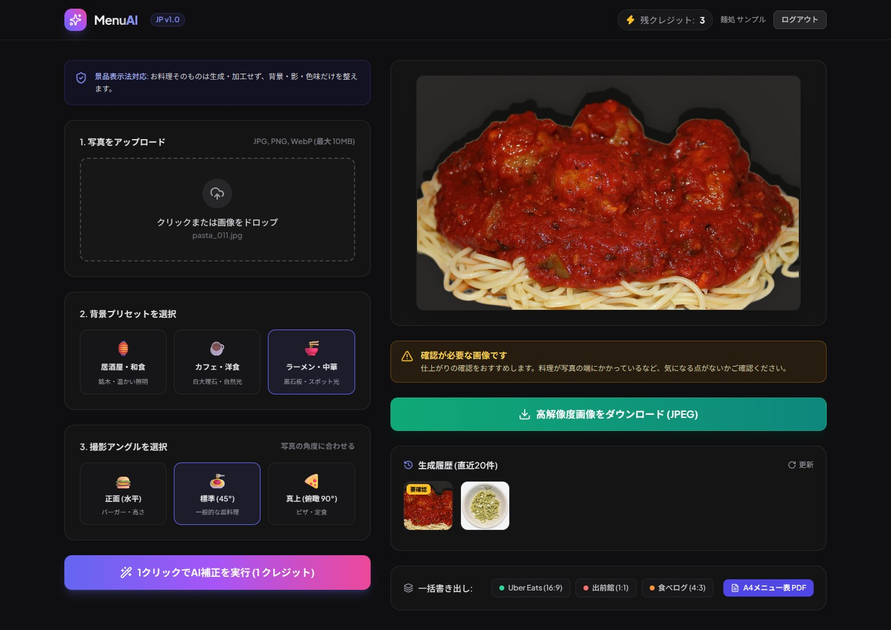

# MenuAI Web アプリ

飲食店の方が料理の写真をアップロードすると、背景をきれいに整えたメニュー用の画像ができあがる Web アプリです。

MenuAI は 2 つのリポジトリでできています。

| リポジトリ | 役割 |
|---|---|
| **menu-ai**（ここ） | お店の人が使う Web アプリ（Laravel）。ログイン、クレジット、写真のアップロード、処理状況の確認を担当します |
| [menu-ai-service](https://github.com/doromi22/menu-ai-service) | 写真から料理を切り抜いて合成する AI サービス（Python）。処理の中身や、実際の写真で見つかった問題と直し方は、こちらの README にまとめています |

## AI コーディングツールの利用について

実装の大部分は AI コーディングツール（Claude Code）を用いており、
コミットの Co-Authored-By に記録している。

自分が担当したのは以下である。

- アーキテクチャの決定（ADR パターンの採用、Web 層と AI 層の分離）
- ビジネスルールの定義と、その整合性の検証
- モデル選定とトレードオフの判断（BiRefNet の採用、生成 AI を採らない判断）
- 景品表示法上のリスクを踏まえた仕様の決定
- リファクタリングの方向づけとレビュー

コードの各行を自分で書いたとは主張しない。

## 画面

写真を選び、背景のプリセットを選んでボタンを押すと、10 秒ほどで背景を整えた画像ができあがります。



人が確認したほうがよい画像（REVIEW）のときは、ダウンロードボタンの上に案内が出ます。生成履歴にも「要確認」の印が付きます。
下の例では、料理が写真の下と左右の端にかかっているため、確認をおすすめしています。



<sub>どちらも、ローカルで動かしたこのアプリで実際に処理した画面です。写真の出典: [docs/images/CREDITS.md](docs/images/CREDITS.md)</sub>

## 全体の流れ


写真を 1 枚アップロードしたときの流れです。

1. **受付**: ブラウザから `POST /api/images/upload` が届くと、`UploadImageAction` が入力をチェックします。
2. **業務処理**: `Domain\Image\UploadImage` がクレジットを 1 つ使い、元の写真を保存して、処理を「キュー」に登録します。
3. **応答**: `UploadImageResponder` が、受け付けたことをすぐにブラウザへ返します（201）。画像の処理はまだ終わっていません。
4. **裏側での処理**: キューワーカーが順番に仕事を取り出し、`menu-ai-service` に画像の処理を依頼して、結果を保存します。
5. **状況の確認**: ブラウザは `GET /api/images/{id}/status` を 1 秒ごとに呼び、処理が終わったかを確認します。

画像の処理には 10 秒前後かかるため、アップロードのリクエストの中では処理せず、キューで後から処理しています。

## コードの設計: Action-Domain-Responder（ADR）

画面からのリクエストを処理する部分は、MVC のコントローラーではなく **ADR パターン**で書いています。
1 つの API に対して 1 つの Action クラスがあり、処理を次の 3 つに分けています。

| 役割 | 担当すること | 場所 |
|---|---|---|
| **Action** | リクエストを受け取って入力をチェックし、Domain を呼んで、結果を Responder に渡す | `app/Http/Actions/` |
| **Domain** | アプリのルール（クレジットの使い方、登録の条件など） | `app/Domain/` |
| **Responder** | ブラウザに返す JSON の形を組み立てる | `app/Http/Responders/` |

コントローラーに全部を書くと、「入力チェック」「ルール」「返す形」が 1 か所に混ざり、ルールだけをテストしたり直したりしにくくなります。
ADR では役割ごとにファイルが分かれているので、たとえば「クレジットの使い方」を変えたいときは `app/Domain/Image/UploadImage.php` だけを見れば済みます。Domain はリクエストや JSON を扱わないので、HTTP を通さずにテストすることもできます（例: `tests/Unit/ProcessingOutcomeTest.php`）。

```
app/
  Http/
    Actions/        API ごとの入口（入力のチェックだけ）
    Responders/     JSON の組み立て。ユーザーと画像の JSON の形は Payloads/ に集約
  Domain/
    Auth/           RegisterUser: 使い捨てメールの拒否、無料クレジットを付ける条件
    Image/          UploadImage: クレジットを使い、写真を保存し、処理を登録する
                    ListUserImages: 自分の画像の一覧
                    ProcessingOutcome: 処理結果をお店の人向けの言葉に変える
  Services/         StandardAiService: menu-ai-service への通信と、結果の保存
  Jobs/             ProcessStandardImageJob（通常）/ ProcessImageJob（Premium）
```

この構成に作り直す前に、今の API の動き（ステータスコードや JSON の形）を固定するテストを先に書きました。作り直したあとも同じテストがすべて通ることを確認しています。

## 気をつけているポイント

- **クレジットがマイナスにならない**: 「残りが 1 以上なら 1 減らす」を 1 回のデータベース更新で行っています。同じ人が同時に 2 回アップロードしても、残高がマイナスになることはありません。
- **失敗したらクレジットを戻す**: 使える画像ができなかったとき（REJECT、サーバー側の障害、AI サービスにつながらない）は、処理状態を `failed` にしてクレジットを 1 つ戻します。REVIEW は画像ができているので戻しません。
- **結果の記録**: どの基準で判定したか（基準値のハッシュ）、各段階の判定（PASS / REVIEW / REJECT）、サーバー側の障害かどうか、再実行した回数を `images` テーブルに保存します。判定の理由コードは `image_processing_reasons` テーブルに 1 件ずつ保存するので、「どの理由の REVIEW が多いか」を集計できます。
- **わかりやすいメッセージ**: 状況確認の API は、確認が必要かどうか（`review_required`）と、お店の人向けの日本語メッセージを返します。画面ではこれを使って、確認が必要な画像に案内と「要確認」の印を表示します。サーバー側の障害のときは、「この写真には対応していません」ではなく「一時的なエラー」と伝えるようにしています。
- **設定の切り替え**: `config/services.php` の `image_processing` で、処理に使うエンジン（通常は `standard`、`premium` にすると以前の画像生成 AI 方式）と、画面で選ぶ背景と AI サービス側のテンプレートの対応を設定します。

## ローカルで動かす

**必要なもの**: PHP 8.3 以上、Composer、そしてポート 8002 で動いている AI サービス。
AI サービスは、このリポジトリと同じ階層に `ai-service` という名前で置いてください（テストがこの場所を使います）。

```bash
git clone https://github.com/doromi22/menu-ai-service ../ai-service
```

**準備**

```bash
composer install && cp .env.example .env && php artisan key:generate
```

```bash
php artisan migrate && php artisan storage:link
```

`.env.example` はそのままだと SQLite を使います。MySQL を使う場合は `.env` の `DB_*` を設定してください（開発では MySQL を使っています）。

**起動**: 次の 3 つを、それぞれ別のターミナルで起動します。

```bash
php artisan serve
```

```bash
php artisan queue:work
```

```bash
cd ../ai-service && ./venv/Scripts/python.exe -m uvicorn standard.api.main:app --port 8002
```

ブラウザで http://127.0.0.1:8000 を開きます。

`queue:work` は起動したときのコードを使い続けます。ジョブのコードを変えたら、`queue:work` を止めて起動し直してください。

## テスト

```bash
php artisan test
```

36 件のテストがあり、SQLite のメモリ上のデータベースで動きます。
`StandardPipelineEndToEndTest` は、隣の `ai-service` で実際に API サーバーを起動し、処理結果がデータベースに保存されるまでを確認します（切り抜きはテスト用の簡易版を使うので、モデルのダウンロードは不要です）。

## まだできていないこと

- **一括書き出しボタン**: 画面下の「Uber Eats」「出前館」「食べログ」のボタンは見た目だけで、まだ動きません。
- **メニュー表の PDF 出力**: `/api/menu-boards/pdf` はまだ作っておらず、「準備中」のメッセージを返すだけです。
