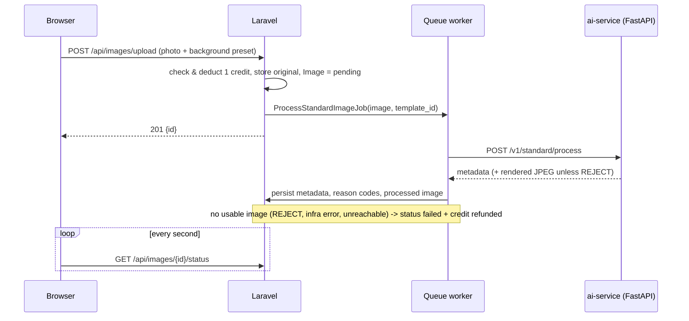

# MenuAI - web app

Merchant-facing web app for MenuAI: a restaurant uploads a phone photo of a
dish and gets back a clean menu image on a styled background. This
repository is the Laravel side (accounts, credits, upload, queue, status
polling). The image processing itself - segmentation, compositing,
integrity validation - lives in the separate **`ai-service`** repository,
whose README covers the engine, the real-photo findings and before/after
images.

## How an upload flows



- **`app/Jobs/ProcessStandardImageJob.php`** - queue lifecycle and refund
  rule. REVIEW still returns an image, so it is not refunded.
- **`app/Services/StandardAiService.php`** - the HTTP call and persistence.
  Pipeline metadata (policy hash, PASS/REVIEW/REJECT per stage,
  `is_infra_error`, retry count) goes onto `images`; reason codes go into
  `image_processing_reasons`, one row per code, so REVIEW volume can be
  queried by reason.
- **`config/services.php` -> `image_processing`** - which engine uploads go
  to (`standard` by default, `premium` = the earlier Modal-hosted generative
  engine via `ProcessImageJob`) and the UI preset -> template mapping.

## Running locally

Needs PHP 8.3+, Composer, and `ai-service` running on port 8002.
`.env.example` defaults to SQLite; development used MySQL (set the `DB_*`
values in `.env`).

```bash
composer install && cp .env.example .env && php artisan key:generate
```

```bash
php artisan migrate && php artisan storage:link
```

Then three processes:

```bash
php artisan serve
```

```bash
php artisan queue:work
```

```bash
cd ../ai-service && ./venv/Scripts/python.exe -m uvicorn standard.api.main:app --port 8002
```

Open http://127.0.0.1:8000. Restart `queue:work` after changing job code - the
worker keeps the old code in memory.

## Tests

```bash
php artisan test
```

14 tests, SQLite in-memory. `StandardPipelineEndToEndTest` starts a real
`uvicorn` process from the sibling `ai-service` checkout (with a fake
segmentation backend, so no model download) and checks a response lands in
the database.

## Known gaps

- REVIEW results are shown like any completed image; the UI has no "needs
  review" state yet.
- `StandardAiService::userMessageFor()` returns Korean messages while the UI
  is Japanese, so those messages are not surfaced in the UI yet.
