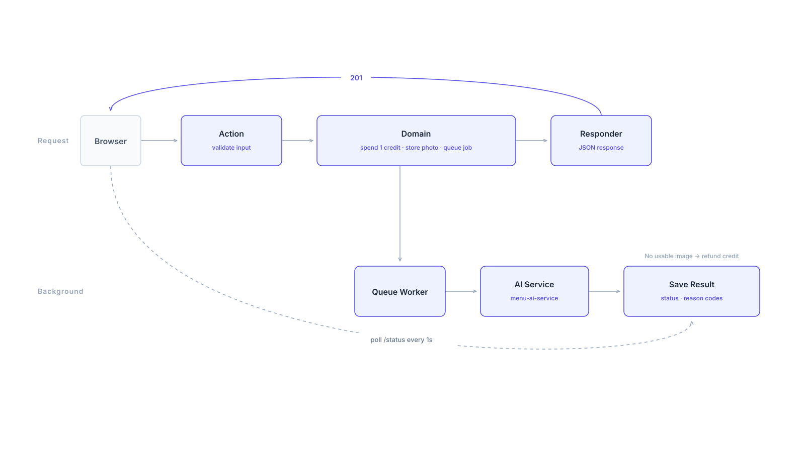

# MenuAI - Web アプリ

MenuAI の加盟店向け Web アプリです。飲食店が料理の写真をアップロードすると、背景を整えたメニュー用画像が返ってきます。
このリポジトリは Laravel 側（アカウント、クレジット、アップロード、キュー、ステータス確認）です。セグメンテーション・合成・整合性検証といった画像処理本体は別リポジトリ [`menu-ai-service`](https://github.com/doromi22/menu-ai-service) にあり、エンジンの設計、実写真で見つかった問題、修正前後の比較画像はそちらの README にまとめています。

## 設計: Action-Domain-Responder（ADR）

HTTP 層は MVC のコントローラではなく ADR パターンで構成しています。エンドポイント 1 つにつき Action 1 つで、責務を 3 層に分けています。

```
app/
  Http/
    Actions/        HTTP の入力だけを扱う（バリデーション、認証状態、ルートモデル）。業務ロジックは持たない
    Responders/     JSON レスポンスの組み立てだけを扱う。ユーザー・画像の形は Payloads/ に集約
  Domain/
    Auth/           RegisterUser: 使い捨てメールの拒否、無料クレジットの付与条件（不正登録対策）
    Image/          UploadImage: クレジット消費・原本保存・処理エンジンへの投入
                    ListUserImages / ProcessingOutcome: 処理結果が加盟店にとって何を意味するか
  Services/         StandardAiService: ai-service への HTTP 呼び出しと結果の保存（インフラ）
  Jobs/             ProcessStandardImageJob（既定）/ ProcessImageJob（Premium）
```

例えばアップロードでは、`UploadImageAction` がリクエストを検証し、`Domain\Image\UploadImage` がクレジットを消費してジョブを投入し、`UploadImageResponder` がレスポンスを返します。
Domain は `Request` オブジェクトもレスポンスの形も扱わないため、業務ルールを HTTP を経由せずに呼び出してテストできます（例: `tests/Unit/ProcessingOutcomeTest.php`）。

リファクタリングの前に、既存エンドポイントのステータスコードと JSON の形を固定する characterization テストを先に追加し、構造変更の後も同じテストが通ることを確認しています。

## アップロードの流れ



1. `POST /api/images/upload` を `UploadImageAction` が受け、`Domain\Image\UploadImage` がクレジットを 1 消費して原本を保存し、`ProcessStandardImageJob` を投入します。`UploadImageResponder` が 201 を返します。
2. キューワーカーが `menu-ai-service` の `POST /v1/standard/process` を呼び、メタデータ・理由コード・処理済み画像を保存します。
3. ブラウザは `GET /api/images/{id}/status` を 1 秒ごとに確認します。

- **クレジット消費**は「残高 1 以上なら減らす」を 1 つの UPDATE で行うため、同時に 2 件アップロードしても残高がマイナスになりません。
- **返却ルール**: REVIEW は画像が返るため返却しません。
- **保存するメタデータ**: ポリシーハッシュ、段階ごとの PASS/REVIEW/REJECT、`is_infra_error`、再試行回数を `images` に保存し、理由コードは 1 コード 1 行で `image_processing_reasons` に保存します。これにより、REVIEW がどの理由で多いかを集計できます。
- **ステータス API** は `review_required` と、加盟店向けの日本語メッセージ（`Domain\Image\ProcessingOutcome`）を返します。インフラ障害は必ず「一時的なエラー」として扱い、「この写真には対応していません」と誤って伝えないようにしています。
- **`config/services.php`** の `image_processing` で、アップロード先のエンジン（既定は `standard`、`premium` は Modal 上の旧生成モデル方式）と、画面のプリセットとテンプレートの対応を設定します。

## ローカルでの実行

PHP 8.3 以上、Composer、ポート 8002 で動いている AI サービスが必要です。AI サービスはこのリポジトリの隣に `ai-service` という名前で配置します（エンドツーエンドテストがこのパスを参照します）。

```bash
git clone https://github.com/doromi22/menu-ai-service ../ai-service
```

`.env.example` の既定は SQLite です（開発では MySQL を使用。`.env` の `DB_*` を設定してください）。

```bash
composer install && cp .env.example .env && php artisan key:generate
```

```bash
php artisan migrate && php artisan storage:link
```

次の 3 つのプロセスを起動します。

```bash
php artisan serve
```

```bash
php artisan queue:work
```

```bash
cd ../ai-service && ./venv/Scripts/python.exe -m uvicorn standard.api.main:app --port 8002
```

http://127.0.0.1:8000 を開きます。ジョブのコードを変更したら `queue:work` を再起動してください（ワーカーは古いコードをメモリに保持し続けます）。

## テスト

```bash
php artisan test
```

35 件、SQLite のインメモリ DB で実行します。`StandardPipelineEndToEndTest` は隣の `ai-service` から実際の `uvicorn` プロセスを起動し（セグメンテーションは偽のバックエンドを使うため、モデルのダウンロードは不要）、レスポンスが DB に保存されるまでを確認します。

## 残っている課題

- REVIEW になった画像も、画面上は通常の完了と同じように表示されます。ステータス API は `review_required` を返していますが、画面側ではまだ使っていません。
- メニュー表の PDF 出力（`/api/menu-boards/pdf`）は未実装で、準備中のメッセージを返すだけです。
